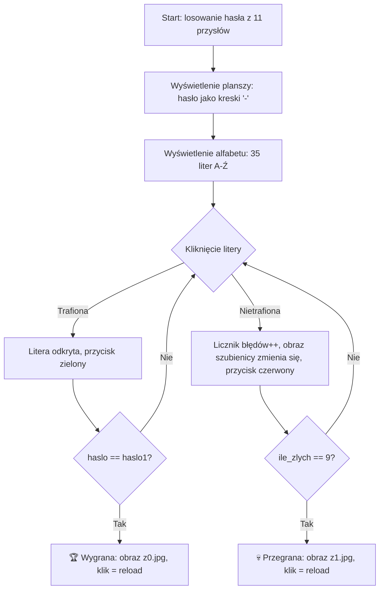
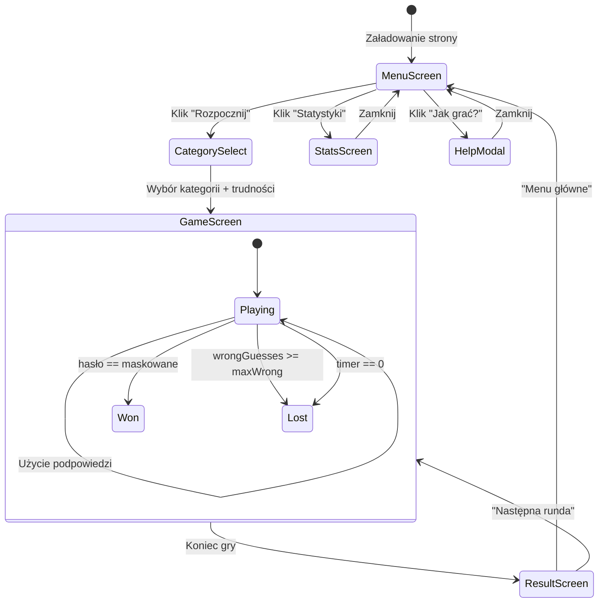

# 🎮 Hangman Game v2.0 — Dokument Projektowy

> **Cel dokumentu:** Pełna specyfikacja rozbudowy gry Hangman, wystarczająco szczegółowa, aby inny agent mógł na jej podstawie zaimplementować kompletną aplikację bez dodatkowych pytań.

---

## 📍 1. Lokalizacja Projektu

| Element | Ścieżka |
|---|---|
| **Katalog źródłowy (v1.0)** | `C:\Users\Dawid\.cursor\projects\Hangmane-Game\Hangman-Game\` |
| **Katalog docelowy (v2.0)** | `C:\Users\Dawid\.gemini\antigravity-cli\scratch\hangman-game-v2\` |

> [!IMPORTANT]
> Nowa wersja powinna być tworzona w katalogu docelowym. Nie modyfikuj oryginalnych plików v1.0.

---

## 📋 2. Analiza Aktualnej Wersji (v1.0)

### 2.1. Pliki źródłowe

| Plik | Opis |
|---|---|
| [szubienica.html](file:///C:/Users/Dawid/.cursor/projects/Hangmane-Game/Hangman-Game/szubienica.html) | Główny plik HTML — minimalna struktura: kontener, plansza z hasłem, obraz szubienicy, alfabet |
| [szubienica.js](file:///C:/Users/Dawid/.cursor/projects/Hangmane-Game/Hangman-Game/szubienica.js) | Logika gry — 167 linii, kod proceduralny |
| [style.css](file:///C:/Users/Dawid/.cursor/projects/Hangmane-Game/Hangman-Game/style.css) | Style CSS — 82 linie, czarne tło, IBM Plex Mono |
| `img.rar` | Archiwum z obrazami szubienicy (s0.jpg–s9.jpg) i ekranów końcowych (z0.jpg, z1.jpg) |

### 2.2. Aktualna logika gry



### 2.3. Zidentyfikowane problemy i bugi w v1.0

> [!WARNING]
> Poniższe problemy **MUSZĄ** być naprawione w v2.0.

| # | Problem | Opis | Priorytet |
|---|---|---|---|
| 1 | **Bug w losowaniu** | `Math.round(Math.random() * length)` może zwrócić wartość równą `length`, co daje `undefined`. Poprawne: `Math.floor(Math.random() * length)` | 🔴 Krytyczny |
| 2 | **Brak klamr w if (zwycięstwo/przegrana)** | Linie 153-156 i 162-165: `if` bez `{}` — wykonuje się tylko pierwsza instrukcja, druga (`style.cursor`) wykonuje się ZAWSZE | 🔴 Krytyczny |
| 3 | **Brak blokady klikniętych trafień** | Po trafieniu litera zmienia kolor, ale `onclick` nadal działa — można klikać tę samą literę wielokrotnie | 🟡 Średni |
| 4 | **Zmienne globalne** | Cały kod operuje na zmiennych globalnych (`wylosowane_haslo`, `haslo`, `ile_zlych` itd.) | 🟡 Średni |
| 5 | **Zależność od plików JPG** | Obrazy w formacie JPG (s0-s9, z0-z1) muszą być wypakowane z RAR — brak fallbacku | 🟡 Średni |
| 6 | **Brak responsywności** | Stała szerokość 900px, brak media queries — nie działa na telefonach | 🟡 Średni |
| 7 | **Brak modularności** | Prototype extension `String.prototype.ustawZnak` — modyfikacja wbudowanego obiektu | 🟢 Niski |
| 8 | **Brak `#` przy kolorze** | Linia 138: `background: "330000"` zamiast `"#330000"` | 🟢 Niski |

---

## 🎯 3. Specyfikacja Nowych Funkcjonalności v2.0

### 3.1. Rysowanie szubienicy na Canvas (zamiast obrazów JPG)

> **Cel:** Eliminacja zależności od plików graficznych. Szubienica rysowana dynamicznie na `<canvas>`.

**Wymagania:**
- Element `<canvas id="hangman-canvas" width="300" height="350">`
- 9 etapów rysowania (odpowiadających 9 błędnym odpowiedziom):
  1. Podstawa (pozioma linia na dole)
  2. Słup pionowy
  3. Belka górna (pozioma)
  4. Linka/sznur
  5. Głowa (koło)
  6. Tułów (linia pionowa)
  7. Lewa ręka (linia ukośna)
  8. Prawa ręka (linia ukośna)
  9. Lewa noga + Prawa noga (obie naraz — ostatni etap = przegrana)
- Kolor linii: `#e0e0e0` (jasny szary) na ciemnym tle
- Grubość linii: `4px`
- Animacja rysowania: każda część powinna być rysowana z efektem animacji (progressive draw w ~300ms)
- Funkcja `drawHangman(step)` — rysuje etap 1-9
- Funkcja `resetCanvas()` — czyści canvas

### 3.2. System kategorii haseł

> **Cel:** Urozmaicenie gry i dodanie elementu edukacyjnego.

**Wymagania:**
- Minimum 5 kategorii, każda z minimum 15 hasłami:

| Kategoria | Ikona | Przykładowe hasła |
|---|---|---|
| 🏛️ Przysłowia polskie | 🏛️ | (istniejące 11 + nowe 4+) |
| 🌍 Stolice świata | 🌍 | Warszawa, Budapeszt, Waszyngton, Kuala Lumpur, Buenos Aires... |
| 🎬 Tytuły filmów | 🎬 | Skazani na Shawshank, Chłopaki nie płaczą, Ojciec Chrzestny... |
| 🔬 Nauka i technologia | 🔬 | Fotosynteza, Grawitacja, Algorytm, Sztuczna inteligencja... |
| 🍕 Jedzenie i kuchnia | 🍕 | Pierogi ruskie, Bigos staropolski, Szarlotka, Tiramisu... |

- Przed rozpoczęciem gry: ekran wyboru kategorii (karty z ikonami)
- Opcja "🎲 Losowa kategoria" — losuje kategorię i hasło
- Wyświetlanie aktualnej kategorii nad planszą w trakcie gry
- Hasła przechowywane w obiekcie JS:
```javascript
const CATEGORIES = {
    proverbs: {
        name: "Przysłowia polskie",
        icon: "🏛️",
        words: ["BEZ PRACY NIE MA KOŁACZY", ...]
    },
    capitals: {
        name: "Stolice świata",
        icon: "🌍",
        words: ["WARSZAWA", ...]
    },
    // ...
};
```

### 3.3. System punktacji i statystyk

> **Cel:** Motywacja gracza do kontynuowania gry.

**Wymagania:**
- **Punkty za rundę** obliczane wg wzoru:
  ```
  punkty = (liczba_liter_w_hasle × 10) - (ile_zlych × 15) + bonus_czasowy
  ```
  - `bonus_czasowy`: jeśli rozwiązanie < 30s → +50pkt, < 60s → +25pkt, > 60s → +0pkt
- **Statystyki sesji** (wyświetlane na bieżąco w panelu bocznym lub headerze):
  - Aktualna seria zwycięstw (streak)
  - Łączna liczba gier
  - Wygrane / Przegrane
  - Procent wygranych
  - Najlepszy wynik
  - Łączne punkty
- **Statystyki zapisywane w `localStorage`** pod kluczem `hangman_stats`:
```javascript
{
    totalGames: 0,
    wins: 0,
    losses: 0,
    currentStreak: 0,
    bestStreak: 0,
    bestScore: 0,
    totalScore: 0,
    history: [] // ostatnie 20 gier: { word, category, score, won, date }
}
```
- **Ekran statystyk** dostępny z menu głównego — wizualizacja danych (mini wykresy w CSS, progress bary)

### 3.4. Podpowiedzi (Hints)

> **Cel:** Pomoc dla gracza w trudnych sytuacjach.

**Wymagania:**
- Gracz ma **3 podpowiedzi** na grę (wyświetlane jako 3 ikony 💡 w UI)
- Typy podpowiedzi (gracz wybiera jaki typ):
  1. **Odkryj literę** — losowo odkrywa jedną nieodgadniętą literę (bez kary)
  2. **Pokaż kategorię** — wyświetla dodatkową wskazówkę tekstową (np. dla przysłowia: "dotyczy konsekwencji")
  3. **Eliminuj litery** — usuwa 5 losowych liter z alfabetu, które NIE występują w haśle
- Użycie podpowiedzi kosztuje **-20 punktów** z wyniku końcowego
- Przycisk podpowiedzi wyłącza się gdy limit = 0
- Animacja użycia podpowiedzi: efekt "glow" na odkrytej literze

### 3.5. Obsługa klawiatury fizycznej

> **Cel:** Komfort gry na desktopie.

**Wymagania:**
- Nasłuchiwanie na event `keydown` na `document`
- Mapowanie klawiszy A-Z do polskich liter (uwzględnienie Alt+A=Ą, Alt+E=Ę itd. lub dedykowane mapowanie)
- Podświetlenie aktualnie wciśniętego klawisza (visual feedback na klawiaturze ekranowej)
- Klawisze specjalne:
  - `Enter` — nowa gra (gdy gra zakończona)
  - `Escape` — powrót do menu kategorii
  - `H` (z Ctrl) — użyj podpowiedzi
- Ignorowanie powtórzonych klawiszy (jeśli litera już użyta)
- Klawiatura ekranowa nadal dostępna (klik myszą)

### 3.6. Timer i odliczanie

> **Cel:** Dodanie presji czasowej.

**Wymagania:**
- **Timer na rundę**: domyślnie 120 sekund (2 minuty)
- Wyświetlanie czasu w formacie `MM:SS` w headerze gry
- Wizualne ostrzeżenia:
  - Poniżej 30s: timer zmienia kolor na pomarańczowy
  - Poniżej 10s: timer zmienia kolor na czerwony + pulsująca animacja
- Koniec czasu = przegrana (takie same efekty jak 9 błędów)
- **Opcja wyłączenia timera** w ustawieniach (checkbox "Gra bez limitu czasu")
- Timer pauzowany gdy okno/tab nieaktywne (`visibilitychange` event)

### 3.7. Tryb trudności

> **Cel:** Dostosowanie gry do poziomu gracza.

**Wymagania:**
- 3 poziomy trudności wybierane na ekranie startowym:

| Poziom | Ikona | Próby | Timer | Podpowiedzi | Mnożnik punktów |
|---|---|---|---|---|---|
| Łatwy | 🟢 | 9 błędów | 180s | 3 | ×1.0 |
| Średni | 🟡 | 7 błędów | 120s | 2 | ×1.5 |
| Trudny | 🔴 | 5 błędów | 60s | 1 | ×2.5 |

- Przy mniejszej liczbie prób → mniej etapów rysowania szubienicy (pomijanie wybranych etapów, np. na trudnym: podstawa+słup razem, belka+linka razem)
- Trudność wpływa na mnożnik punktacji końcowej
- Aktualny poziom trudności widoczny w UI

### 3.8. Animacje i efekty wizualne

> **Cel:** Premium look & feel — nowoczesny, dynamiczny interfejs.

**Wymagania:**

#### Paleta kolorów (Dark Mode)
```css
:root {
    --bg-primary: #0a0a1a;        /* Głębokie granatowe tło */
    --bg-secondary: #12122a;      /* Tło kart/paneli */
    --bg-card: #1a1a3e;           /* Tło elementów interaktywnych */
    --accent-primary: #6c5ce7;    /* Fioletowy akcent */
    --accent-secondary: #a29bfe;  /* Jasny fiolet */
    --accent-success: #00e676;    /* Zielony — trafienie */
    --accent-danger: #ff5252;     /* Czerwony — błąd */
    --accent-warning: #ffab40;    /* Pomarańczowy — ostrzeżenie */
    --text-primary: #e8e8f0;      /* Główny tekst */
    --text-secondary: #8888aa;    /* Drugorzędny tekst */
    --glow-primary: rgba(108, 92, 231, 0.4);  /* Efekt glow */
    --glow-success: rgba(0, 230, 118, 0.4);
    --glow-danger: rgba(255, 82, 82, 0.4);
}
```

#### Typografia
- Font główny: **Inter** (Google Fonts) — nagłówki i UI
- Font hasła: **JetBrains Mono** (Google Fonts) — monospace dla liter hasła
- Rozmiary: system fluid typography z `clamp()`

#### Animacje (wszystkie z `prefers-reduced-motion` respektem)
| Element | Animacja | CSS |
|---|---|---|
| Litery alfabetu | Wejście: staggered fade-in od dołu | `animation: fadeInUp 0.3s ease-out backwards; animation-delay: calc(var(--i) * 30ms)` |
| Trafiona litera | Pulse + glow zielony | `@keyframes correctPulse { 0% { transform: scale(1); } 50% { transform: scale(1.15); box-shadow: 0 0 20px var(--glow-success); } 100% { transform: scale(1); } }` |
| Błędna litera | Shake + glow czerwony | `@keyframes wrongShake { 0%,100% { transform: translateX(0); } 25% { transform: translateX(-5px); } 75% { transform: translateX(5px); } }` |
| Odkrycie litery w haśle | Flip (obrót 3D w osi Y) | `transform: rotateY(180deg)` z `perspective` |
| Wygrana | Confetti (CSS particles) + tekst "BRAWO!" z bounce | CSS pseudo-elementowy confetti |
| Przegrana | Screen shake + fade to red | `@keyframes screenShake` |
| Przejścia między ekranami | Slide/fade | `transition: opacity 0.4s, transform 0.4s` |
| Canvas szubienicy | Progressive draw | Canvas `lineTo` z `requestAnimationFrame` |
| Timer < 10s | Pulsacja | `animation: pulse 1s ease-in-out infinite` |

#### Efekty glassmorphism
- Panele i karty: `backdrop-filter: blur(10px); background: rgba(26, 26, 62, 0.7); border: 1px solid rgba(255, 255, 255, 0.1);`
- Subtle shadow: `box-shadow: 0 8px 32px rgba(0, 0, 0, 0.3);`

### 3.9. Ekran startowy (Menu główne)

> **Cel:** Profesjonalne wejście do gry.

**Wymagania:**
- **Layout:** Wycentrowany panel z glassmorphism
- **Elementy:**
  1. Tytuł gry: "SZUBIENICA" z efektem gradient text (fiolet → niebieski)
  2. Podtytuł: "Hangman Game v2.0"
  3. Sekcja wyboru kategorii (karty z ikonami — grid 2×3 lub 3×2)
  4. Sekcja wyboru trudności (3 przyciski: Łatwy / Średni / Trudny)
  5. Checkbox: "⏱ Gra z timerem" (domyślnie włączony)
  6. Przycisk "🎮 ROZPOCZNIJ GRĘ" (duży, gradient, hover effect)
  7. Link "📊 Statystyki" (otwiera panel statystyk)
  8. Link "ℹ️ Jak grać?" (otwiera modal z instrukcją)
- **Animacja wejścia:** Logo i elementy wchodzą z efektem stagger

### 3.10. Ekran końca gry

> **Cel:** Satysfakcjonujące podsumowanie rundy.

**Wymagania:**
- **Wygrana:**
  - Animacja confetti (czyste CSS lub canvas)
  - Tekst "🏆 BRAWO!" z animacją bounce
  - Wyświetlenie: hasło, kategoria, punkty, czas, seria
  - Przyciski: "▶ Następna runda" (ta sama kategoria) | "🏠 Menu główne"
- **Przegrana:**
  - Efekt screen shake
  - Tekst "💀 PRZEGRAŁEŚ!" z fade-in
  - Wyświetlenie poprawnego hasła (z animacją odkrywania)
  - Przyciski: "🔄 Spróbuj ponownie" (nowe hasło) | "🏠 Menu główne"
- **Timeout:**
  - Tekst "⏰ CZAS MINĄŁ!" 
  - Analogiczne do przegranej

### 3.11. Responsywność (Mobile-first)

> **Cel:** Gra działająca na wszystkich urządzeniach.

**Wymagania:**
- **Breakpoints:**
  ```css
  /* Mobile:  < 480px  */
  /* Tablet:  480-768px */
  /* Desktop: > 768px  */
  ```
- **Mobile layout:**
  - Szubienica (canvas) na górze, zmniejszona do ~200×250px
  - Hasło pod szubienicą
  - Klawiatura na dole ekranu (pełna szerokość, 2 wiersze po ~13 liter)
  - Timer i punkty w kompaktowym headerze
  - Podpowiedzi jako mały pasek ikon
- **Tablet layout:**
  - Szubienica po lewej, hasło po prawej
  - Klawiatura na dole
- **Desktop layout:**
  - Pełny layout jak w projekcie: szubienica lewa kolumna, klawiatura prawa kolumna
  - Sidebar ze statystykami
- **Touch-friendly:** Przyciski min. 44×44px, odpowiednie `gap`

### 3.12. Efekty dźwiękowe (opcjonalne, Web Audio API)

> **Cel:** Immersja i feedback sensoryczny.

**Wymagania:**
- Dźwięki generowane przez **Web Audio API** (bez plików .mp3):
  - Trafiona litera: krótki, wysoki "ding" (sine wave, 800Hz, 100ms)
  - Błędna litera: niski "buzz" (square wave, 200Hz, 200ms)
  - Wygrana: melodyjka wznosząca (seria tonów: C-E-G-C)
  - Przegrana: malejący ton (slide 400Hz → 100Hz)
  - Klik przycisku: subtelny "click" (noise, 5ms)
  - Timer < 10s: ticking (krótki pulse co sekundę)
- **Przycisk mute/unmute** 🔊/🔇 w headerze
- Stan mute zapisywany w `localStorage`
- Domyślnie: **wyłączone** (gracz musi włączyć)

---

## 🏗️ 4. Struktura Plików v2.0

```
hangman-game-v2/
├── index.html              # Główny plik HTML
├── css/
│   ├── variables.css       # Zmienne CSS (kolory, fonty, spacing)
│   ├── reset.css           # CSS reset / normalize
│   ├── layout.css          # Grid/flex layout, responsywność
│   ├── components.css      # Style komponentów (przyciski, karty, modale)
│   ├── animations.css      # Wszystkie @keyframes i animacje
│   └── main.css            # Import wszystkich CSS (lub inline w HTML)
├── js/
│   ├── config.js           # Stałe konfiguracyjne (CATEGORIES, DIFFICULTIES)
│   ├── game.js             # Główna klasa Game — logika gry
│   ├── canvas.js           # Rysowanie szubienicy na canvas
│   ├── ui.js               # Zarządzanie DOM, renderowanie ekranów
│   ├── timer.js            # Logika timera
│   ├── stats.js            # System statystyk + localStorage
│   ├── sound.js            # Web Audio API — efekty dźwiękowe
│   ├── keyboard.js         # Obsługa klawiatury fizycznej
│   └── app.js              # Entry point — inicjalizacja, event binding
└── README.md               # Dokumentacja
```

> [!NOTE]
> Wszystkie pliki JS powinny używać **ES Modules** (`type="module"` w `<script>`). Brak potrzeby bundlera — natywne moduły ES.

---

## 📐 5. Architektura Kodu

### 5.1. Klasa `Game` (game.js)

```javascript
class Game {
    constructor(config) {
        // config: { category, difficulty, timerEnabled }
        this.word = '';           // Wylosowane hasło (uppercase)
        this.maskedWord = '';     // Hasło z kreskami
        this.wrongGuesses = 0;
        this.maxWrong = 9;       // Zależne od trudności
        this.guessedLetters = new Set();
        this.hints = 3;          // Zależne od trudności
        this.score = 0;
        this.startTime = null;
        this.isFinished = false;
        this.category = '';
        this.difficulty = '';
    }
    
    start()          // Losuje hasło, resetuje stan, startuje timer
    guess(letter)    // Sprawdza literę, zwraca { hit: bool, positions: [] }
    useHint(type)    // Używa podpowiedzi, zwraca dane
    calculateScore() // Oblicza wynik końcowy
    getState()       // Zwraca aktualny stan gry (do renderowania)
    isWon()          // Sprawdza czy wygrana
    isLost()         // Sprawdza czy przegrana
}
```

### 5.2. Przepływ aplikacji



---

## 🎨 6. Makieta UI — Opisy Ekranów

### 6.1. Menu Główne
```
┌──────────────────────────────────────────────┐
│                                              │
│           ✦ S Z U B I E N I C A ✦           │
│             Hangman Game v2.0                │
│                                              │
│  ┌─────────┐ ┌─────────┐ ┌─────────┐       │
│  │  🏛️     │ │  🌍     │ │  🎬     │       │
│  │Przysłowi│ │ Stolice │ │  Filmy  │       │
│  └─────────┘ └─────────┘ └─────────┘       │
│  ┌─────────┐ ┌─────────┐ ┌─────────┐       │
│  │  🔬     │ │  🍕     │ │  🎲     │       │
│  │  Nauka  │ │Jedzenie │ │ Losowa  │       │
│  └─────────┘ └─────────┘ └─────────┘       │
│                                              │
│     🟢 Łatwy   🟡 Średni   🔴 Trudny       │
│                                              │
│     ☑ Gra z timerem                         │
│                                              │
│     ┌──────────────────────────┐             │
│     │   🎮  ROZPOCZNIJ GRĘ    │             │
│     └──────────────────────────┘             │
│                                              │
│       📊 Statystyki    ℹ️ Jak grać?         │
│                                              │
└──────────────────────────────────────────────┘
```

### 6.2. Ekran Gry (Desktop)
```
┌──────────────────────────────────────────────────────────┐
│  🏛️ Przysłowia  │  ⏱ 01:45  │  🏆 120pkt  │  💡💡💡  │  🔊 │
├──────────────────────────────────────────────────────────┤
│                                                          │
│         _  _  _     _  _  _  _  _     _  _  _           │
│         B  E  Z     P  R  A  C  Y     _  _  _           │
│                                                          │
│         _  _     _  _     _  _  Ł  A  _  _  _           │
│                                                          │
│  ┌────────────┐   ┌──────────────────────────────┐      │
│  │            │   │ A  Ą  B  C  Ć  D  E  Ę  F  │      │
│  │   ╔══╗    │   │ G  H  I  J  K  L  Ł  M  N  │      │
│  │   ║  O    │   │ Ń  O  Ó  P  Q  R  S  Ś  T  │      │
│  │   ║ /│\   │   │ U  V  W  X  Y  Z  Ż  Ź     │      │
│  │   ║ / \   │   └──────────────────────────────┘      │
│  │ ══╩══════ │                                          │
│  └────────────┘                                          │
│                                                          │
│  Seria: 3 🔥  │  Błędy: 4/9  │  Gra #7                 │
└──────────────────────────────────────────────────────────┘
```

### 6.3. Ekran Wyniku (Wygrana)
```
┌──────────────────────────────────────────────┐
│              🎉 🎊 🎉 🎊 🎉                │
│                                              │
│              🏆  B R A W O !                 │
│                                              │
│   Hasło: "BEZ PRACY NIE MA KOŁACZY"        │
│   Kategoria: 🏛️ Przysłowia polskie         │
│   Czas: 0:47                                │
│   Błędy: 3/9                                │
│   Podpowiedzi: 1 użyta                      │
│                                              │
│   ┌───────────────────────────┐              │
│   │    Wynik: ★ 185 pkt ★    │              │
│   └───────────────────────────┘              │
│   Seria zwycięstw: 4 🔥                     │
│                                              │
│   ┌──────────────┐ ┌──────────────┐         │
│   │ ▶ Następna   │ │ 🏠 Menu     │         │
│   └──────────────┘ └──────────────┘         │
└──────────────────────────────────────────────┘
```

---

## 📏 7. Reguły Implementacyjne

> [!IMPORTANT]
> Poniższe reguły **MUSZĄ** być przestrzegane przy implementacji.

### 7.1. HTML
- Semantic HTML5 (`<header>`, `<main>`, `<section>`, `<nav>`, `<footer>`)
- Jeden `<h1>` na stronę ("Szubienica")
- Atrybut `lang="pl"` na `<html>`
- Meta description, viewport, charset UTF-8
- Wszystkie elementy interaktywne muszą mieć unikalne `id`
- Atrybut `aria-label` na interaktywnych elementach dla dostępności

### 7.2. CSS
- Vanilla CSS — **BEZ** frameworków (Tailwind, Bootstrap)
- CSS Custom Properties (`:root` variables) dla theming
- Mobile-first approach: bazowe style dla mobile, `@media (min-width: ...)` dla większych
- Wszystkie animacje z `@media (prefers-reduced-motion: reduce)` — wyłączenie animacji
- BEM-like naming: `.game__letter`, `.game__letter--correct`, `.game__letter--wrong`
- `box-sizing: border-box` globalnie
- System spacing oparty na zmiennej bazowej (8px grid)

### 7.3. JavaScript
- ES Modules (`import`/`export`) z `type="module"` w HTML
- Klasy ES6+ (Game, Timer, Stats, Sound, Canvas, UI)
- `const` / `let` — **BRAK** `var`
- Brak modyfikacji prototypów wbudowanych obiektów
- Event delegation gdzie to możliwe
- Debounce na keyboard events
- Komentarze JSDoc na funkcjach publicznych
- Obsługa błędów (try/catch na localStorage, AudioContext)

### 7.4. Performance
- Brak zewnętrznych bibliotek JS
- Fonty Google z `display=swap`
- Obrazy: brak (canvas zamiast JPG)
- CSS animacje preferowane nad JS animacje (GPU acceleration)
- `requestAnimationFrame` dla canvas

---

## ✅ 8. Checklista Implementacji

Poniższa checklista jest uporządkowana w kolejności implementacji:

- [ ] **Krok 1:** Utworzyć strukturę plików i katalogów
- [ ] **Krok 2:** Napisać `variables.css`, `reset.css` — design tokens
- [ ] **Krok 3:** Napisać `config.js` — kategorie haseł, poziomy trudności, stałe
- [ ] **Krok 4:** Napisać `index.html` — pełna struktura semantyczna ze wszystkimi ekranami (hidden/visible)
- [ ] **Krok 5:** Napisać `canvas.js` — rysowanie szubienicy (9 etapów z animacją)
- [ ] **Krok 6:** Napisać `game.js` — klasa Game z pełną logiką
- [ ] **Krok 7:** Napisać `timer.js` — odliczanie z pausą
- [ ] **Krok 8:** Napisać `stats.js` — localStorage, obliczenia
- [ ] **Krok 9:** Napisać `sound.js` — Web Audio API
- [ ] **Krok 10:** Napisać `keyboard.js` — obsługa klawiszy
- [ ] **Krok 11:** Napisać `ui.js` — renderowanie ekranów, DOM manipulation
- [ ] **Krok 12:** Napisać `app.js` — entry point, łączenie modułów
- [ ] **Krok 13:** Napisać `layout.css`, `components.css` — pełne style
- [ ] **Krok 14:** Napisać `animations.css` — wszystkie animacje
- [ ] **Krok 15:** Dodać responsywność (media queries)
- [ ] **Krok 16:** Testowanie manualne: wszystkie ekrany, scenariusze win/lose/timeout
- [ ] **Krok 17:** Napisać `README.md`

---

## 🔗 9. Referencje

| Zasób | Link / Opis |
|---|---|
| Oryginalna gra v1.0 | [szubienica.html](file:///C:/Users/Dawid/.cursor/projects/Hangmane-Game/Hangman-Game/szubienica.html) |
| Logika v1.0 | [szubienica.js](file:///C:/Users/Dawid/.cursor/projects/Hangmane-Game/Hangman-Game/szubienica.js) |
| Style v1.0 | [style.css](file:///C:/Users/Dawid/.cursor/projects/Hangmane-Game/Hangman-Game/style.css) |
| Google Fonts: Inter | `https://fonts.googleapis.com/css2?family=Inter:wght@400;600;700;800&display=swap` |
| Google Fonts: JetBrains Mono | `https://fonts.googleapis.com/css2?family=JetBrains+Mono:wght@400;700&display=swap` |
| Canvas API docs | MDN Web Docs — CanvasRenderingContext2D |
| Web Audio API docs | MDN Web Docs — Web Audio API |
| localStorage docs | MDN Web Docs — Window.localStorage |

---

> [!TIP]
> Aby rozpocząć implementację, agent powinien pracować wg checklisty z sekcji 8, zaczynając od design tokens i konfiguracji, a kończąc na animacjach i testach.
