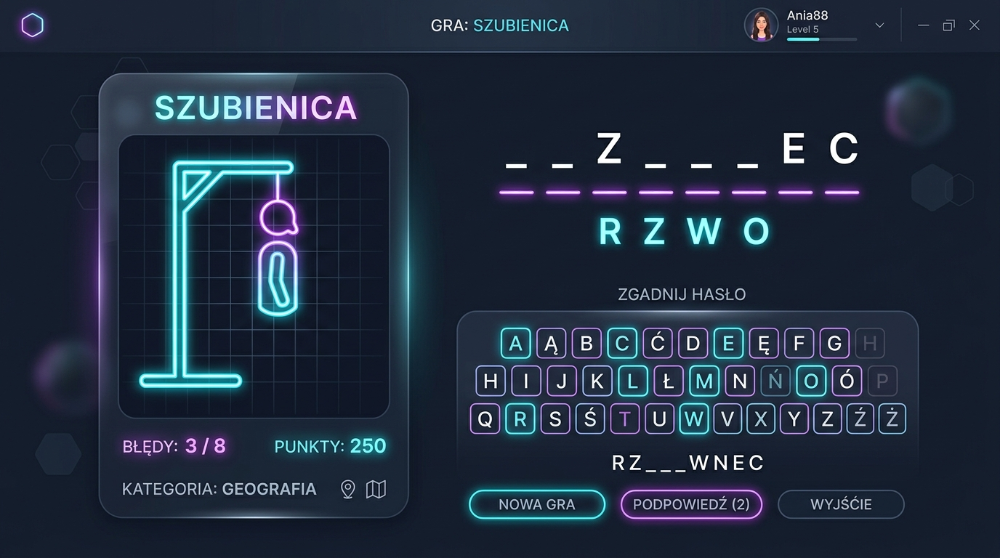

# 🎮 Hangman Game v2.0.1 (Szubienica)

A modern, fully responsive version of the classic "Hangman" game, designed for a premium gameplay experience. It teaches and entertains, offering rich categories, multiple difficulty levels, and statistics tracking.



## 🌟 Features

- **🎨 Modern Design**: Dark theme featuring "glassmorphism", smooth gradients, fluid animations, and particle effects (confetti) built entirely using raw CSS and Canvas.
- **📚 Rich Categories**: Guessing Polish proverbs, world capitals, movie titles, science/technology terms, and culinary items (with a random category option).
- **⚙️ Difficulty Levels**: Three distinct difficulty levels adjusting maximum allowed mistakes, time limits, and score multipliers.
- **⏱️ Timer System**: Active countdown, time pressure alerts (dynamic timer color shifts), and warning ticks as the clock runs down.
- **📊 Advanced Statistics**: Persistent local storage (`localStorage`) tracking games played, wins, losses, current and best win streaks, and score history.
- **💡 Hint Mechanics**: In-game lifelines (revealing a random letter, showing category clues, or eliminating unused keys) that help you out of tight spots at the cost of points.
- **🔊 Procedural Sound Effects**: Dynamic sound effects and melodies generated on the fly via Web Audio API (no external audio files required), complete with an easy mute control.
- **⌨️ Physical Keyboard Support**: Play comfortably on desktop with native support for physical keyboard input, including Polish characters (A-Ź).
- **📱 Responsive Layout**: Built with a mobile-first approach – looks and performs phenomenally on desktops, tablets, and smartphones alike.

## 🚀 How to Run?

The application is built entirely using native web technologies (Vanilla JS, CSS3, HTML5).
No Node.js servers, installation, or bundlers are required to play!

1. Clone this repository or download it as a `.zip` file.
2. Open the project folder on your computer.
3. Open `index.html` in your favorite web browser.
4. Enjoy the game!

## 🛠️ Technologies Used

The application was built with:
* **HTML5** with semantic structure
* **CSS3** with Custom Properties (variables), Flexbox, CSS Grid, and Animations
* **Vanilla JavaScript (ES6 Modules)** applying Object-Oriented programming patterns
* **Canvas API** for drawing the hangman animations frame-by-frame
* **Web Audio API** for procedural sound generation

## 📂 File Structure

```text
hangman-game-v2/
├── index.html              # Main HTML entry point
├── PROJECT_SPEC.md         # Full project specification
├── css/
│   ├── variables.css       # Custom properties and color palettes
│   ├── reset.css           # CSS reset stylesheet
│   ├── layout.css          # Responsive layouts, grids and flexbox styles
│   ├── components.css      # Custom styles for buttons, cards, etc.
│   ├── animations.css      # Keyframes and transition styles
│   └── main.css            # Stylesheets entry point (imports others)
└── js/
    ├── config.js           # Categories, words database, and hints
    ├── game.js             # Core game state engine
    ├── canvas.js           # Smooth hangman drawing canvas control
    ├── ui.js               # UI presentation and DOM manager
    ├── timer.js            # Countdown timer utility
    ├── stats.js            # Local statistics manager
    ├── sound.js            # Procedural audio generator
    ├── keyboard.js         # Hardware keyboard input handler
    └── app.js              # Game application bootstrap and orchestration
```

---
*Inspired by the classic Hangman word game!*
